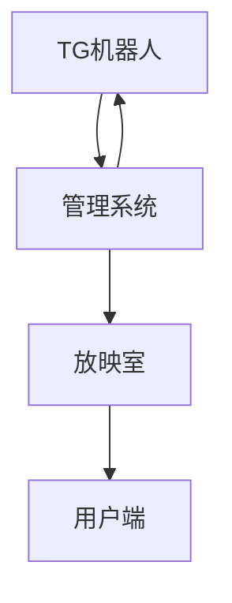

# 在线影视共享放映室系统

一个基于Web的在线影视共享放映室系统，允许多个用户同时观看影片并进行实时互动交流。
克隆仓库全部文件到本地，打开index.html文件即可启动预览。
## 🎬 系统概述

在线影视共享放映室系统是一个创新的观影平台，它允许用户创建虚拟的观影房间，在同一时间共同观看影片，并提供弹幕、评论等互动功能。该系统包含多个核心组件：

- **放映室**: 主要观影界面，支持弹幕和评论
- **管理系统**: 后台管理界面，用于配置放映规则
- **TG机器人**: 用户交互入口，支持投票和通知功能
- **需求分解**: 系统功能和流程的详细说明

## 🔧 核心功能

### 1. 放映室功能
- 视频同步播放
- 实时弹幕系统
- 评论互动功能
- 播放控制面板
- 多设备适配(包括移动端)

### 2. 管理系统功能
- 影片黑/白名单配置
- 放映时间设定
- 用户黑名单管理
- 密码保护设置
- 投票和通知时间配置
- 数据统计与分析

### 3. TG机器人功能
- 影片投票通知
- 投票结果推送
- 放映链接分发
- 放映开始提醒
- 私人放映室创建

## 🏗️ 系统架构

### 名词定义

- **放映室**: 虚拟房间，用户在此同步观看视频，支持弹幕和评论。支持创建公共/私人放映室。
- **TG机器人**: 不同角色权限的用户进行观影相关规则配置。作为平台入口，用于投票、通知和链接到观影室。

## 📋 功能详解

### 播放规则
- 管理后台配置放映开始时间
- 影片黑/白名单管理
- 用户黑名单设置
- 放映室密码加密开关

### 机器人通知
- 通过TG机器人推送各类消息
- 包括投票链接、投票结果、放映链接等

### 投票选择
- 用户通过TG机器人投票影片建议
- 系统自动统计选出本周影片

### 弹幕评论
- 实时文字评论显示在视频播放界面上
- 放映开始前为评论模式，可畅聊影片相关内容
- 放映开始后为弹幕模式，同步显示在播放页面

## 🎨 界面预览

### 放映室界面

### 管理系统界面
*管理系统提供完整的后台配置功能*

### TG机器人界面
*通过Telegram机器人实现用户交互*

## 🚀 使用流程

1. 管理员在管理系统中配置影片列表和放映时间
2. TG机器人推送投票通知给所有用户
3. 用户通过TG机器人参与影片投票
4. 系统统计投票结果并通过机器人通知
5. 到达放映时间时，机器人推送放映链接
6. 用户点击链接进入放映室观看影片并互动

## 👥 用户角色

- **管理员**: 拥有完整系统权限，可以配置所有参数
- **普通用户**: 可以参与投票、观看影片、发送弹幕和评论

## 🛠️ 技术栈

- 前端: HTML5, CSS3, JavaScript
- 框架: Axure RP (原型设计)
- 后端集成: Telegram Bot API
- 数据存储: JavaScript数据文件

## 📊 系统模块

### 需求分解
系统需求被细分为以下几个关键组成部分：
- 管理后台：影片配置、时间安排、安全设置等
- TG机器人：投票通知、结果推送、链接分发等
- 放映室：视频播放、弹幕显示、用户互动等

## 📞 联系方式

如有任何问题或建议，请联系项目维护团队。

## © 版权信息

本项目为在线影视共享放映室系统原型设计文档，所有权利保留。